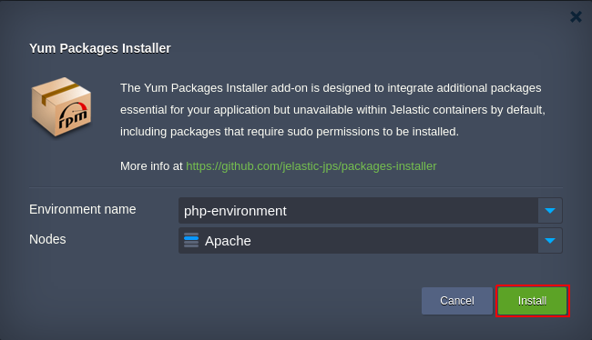
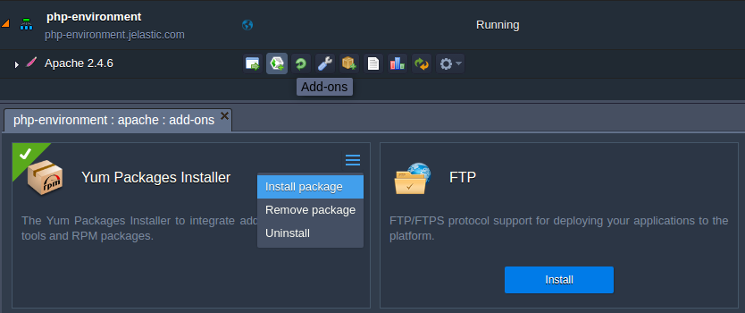
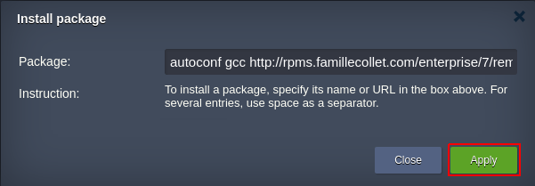

# Yum Packages Installer Add-On

The Yum Packages Installer add-on enables to integrate packages essential for your application but unavailable within
Jelastic containers by default, including packages that require sudo permissions to be installed. In particular, it can be
used for the following purposes:
- to integrate [*gcc*](https://gcc.gnu.org/) and additional dev tools (e.g. [*autoconf*](http://www.gnu.org/software/autoconf/autoconf.html)) to compile extra PHP modules
- to install RPM packages from repository by specifying direct link to a package or just its name

The add-on utilizes [*yum*](http://yum.baseurl.org/) to install and remove packages on a destination container. 

**Type of nodes this add-on can be applied to:**

You can run Packages Installer on any **CentOS-based** [software stacks](https://docs.jelastic.com/software-stacks-versions)
within Jelastic Cloud, these are all available stacks with the exception of VPS ([Windows](https://docs.jelastic.com/win-vps)
& [Ubuntu](https://docs.jelastic.com/vps-ubuntu)). You can also run the add-on to install packages within custom non
certified [**Docker**](https://docs.jelastic.com/dockers-overview) containers, as an alternative to using [Jelastic SSH Gate](https://docs.jelastic.com/ssh-gate) with root permissions. 

To learn more about [Jelastic Add-ons](https://github.com/jelastic-jps/jpswiki/wiki/Jelastic-Addons) and their usage, refer
to the linked guide. 

## How to Integrate Yum Packages Installer to Jelastic Environment

To install the add-on, copy link to the *manifest.jps* file above and [import](https://docs.jelastic.com/environment-import)
it to the destination environment on your [Jelastic Cloud Platform](https://jelastic.cloud/).

In the installation dialog box, specify the following details:
- **_Environment name_** - destination environment with a node the add-on should be installed to
- **_Nodes_** - node that requires additional packages’ integration

When you are finished, click **Install** to continue.

When installation is completed, **Close** the appeared confirmation message and click **Add-ons** next to the destination
node to locate the **Yum Packages Installer** add-on plank.

Expand the menu in its upper-right corner, choose the **Install package** option and specify either name and/or URL of the
required tools (if installing several packages at once, use space as a separator).

**Note** that the add-on searches for a package specified by name within repositories listed in the **_/etc/yum.repos.d_**
directory on a destination container.

Click **Apply** to complete installation.

To see a list of installed packages, access a container via [SSH](https://docs.jelastic.com/ssh-gate) and run the **_rpm -qa_** command to print all available packages or **_rpm -qa | [grep](http://linuxcommand.org/man_pages/grep1.html) [options] PATTERN [FILE...]_** to print packages matching a pattern.

To delete the earlier installed package, click **Remove package**, specify its name (not URL) and **Apply** the
changes. 
